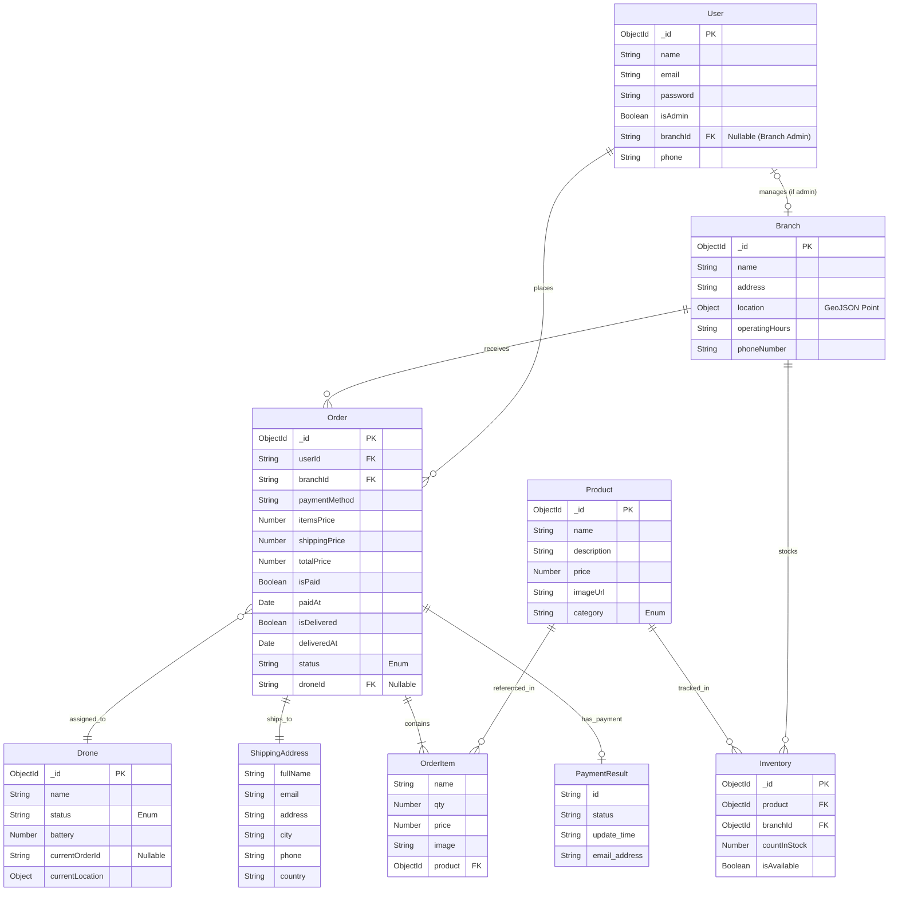
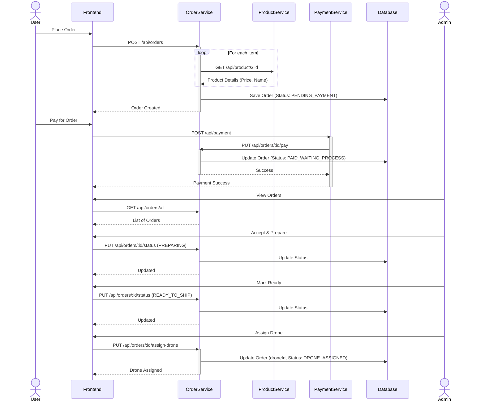
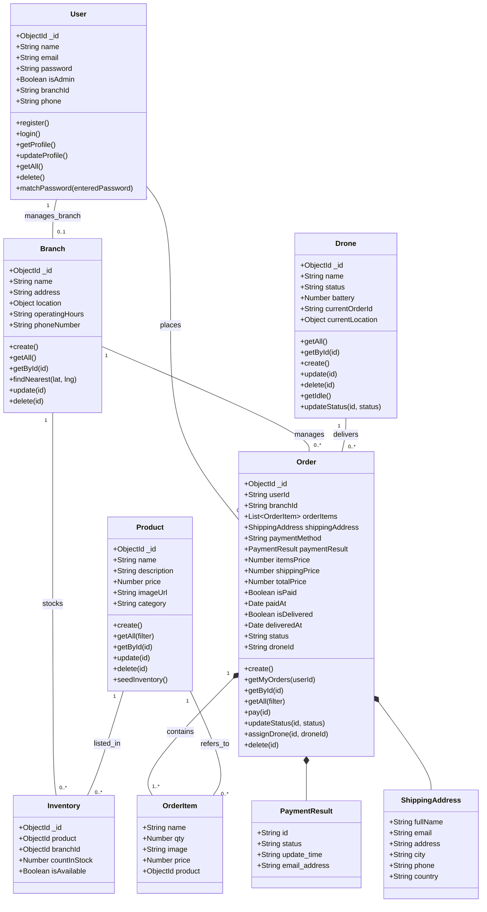

# Backend Diagrams

## Entity Relationship Diagram (ERD)

```mermaid
erDiagram
    User ||--o{ Order : "places"
    User |o--o| Branch : "manages (if admin)"
    Branch ||--o{ Order : "receives"
    Branch ||--o{ Inventory : "stocks"
    Product ||--o{ Inventory : "tracked_in"
    Product ||--o{ OrderItem : "referenced_in"
    Order ||--|{ OrderItem : "contains"
    Order }o--|| Drone : "assigned_to"
    Order ||--|| ShippingAddress : "ships_to"
    Order ||--o| PaymentResult : "has_payment"

    User {
        ObjectId _id PK
        String name
        String email
        String password
        Boolean isAdmin
        String branchId FK "Nullable (Branch Admin)"
        String phone
    }

    Branch {
        ObjectId _id PK
        String name
        String address
        Object location "GeoJSON Point"
        String operatingHours
        String phoneNumber
    }

    Product {
        ObjectId _id PK
        String name
        String description
        Number price
        String imageUrl
        String category "Enum"
    }

    Inventory {
        ObjectId _id PK
        ObjectId product FK
        ObjectId branchId FK
        Number countInStock
        Boolean isAvailable
    }

    Order {
        ObjectId _id PK
        String userId FK
        String branchId FK
        String paymentMethod
        Number itemsPrice
        Number shippingPrice
        Number totalPrice
        Boolean isPaid
        Date paidAt
        Boolean isDelivered
        Date deliveredAt
        String status "Enum"
        String droneId FK "Nullable"
    }

    OrderItem {
        String name
        Number qty
        Number price
        String image
        ObjectId product FK
    }

    ShippingAddress {
        String fullName
        String email
        String address
        String city
        String phone
        String country
    }

    PaymentResult {
        String id
        String status
        String update_time
        String email_address
    }

    Drone {
        ObjectId _id PK
        String name
        String status "Enum"
        Number battery
        String currentOrderId "Nullable"
        Object currentLocation
    }
```

## Sequence Diagram: Order Placement & Delivery Flow

```mermaid
sequenceDiagram
    actor User
    participant Frontend
    participant OrderService
    participant ProductService
    participant PaymentService
    participant Database
    actor Admin

    %% 1. Order Creation
    User->>Frontend: Place Order
    Frontend->>OrderService: POST /api/orders
    activate OrderService
    loop For each item
        OrderService->>ProductService: GET /api/products/:id
        ProductService-->>OrderService: Product Details (Price, Name)
    end
    OrderService->>Database: Save Order (Status: PENDING_PAYMENT)
    OrderService-->>Frontend: Order Created
    deactivate OrderService

    %% 2. Payment
    User->>Frontend: Pay for Order
    Frontend->>PaymentService: POST /api/payment
    activate PaymentService
    PaymentService->>OrderService: PUT /api/orders/:id/pay
    activate OrderService
    OrderService->>Database: Update Order (Status: PAID_WAITING_PROCESS)
    OrderService-->>PaymentService: Success
    deactivate OrderService
    PaymentService-->>Frontend: Payment Success
    deactivate PaymentService

    %% 3. Order Processing (Admin)
    Admin->>Frontend: View Orders
    Frontend->>OrderService: GET /api/orders/all
    OrderService-->>Frontend: List of Orders
    
    Admin->>Frontend: Accept & Prepare
    Frontend->>OrderService: PUT /api/orders/:id/status (PREPARING)
    OrderService->>Database: Update Status
    OrderService-->>Frontend: Updated

    Admin->>Frontend: Mark Ready
    Frontend->>OrderService: PUT /api/orders/:id/status (READY_TO_SHIP)
    OrderService->>Database: Update Status
    OrderService-->>Frontend: Updated

    %% 4. Drone Assignment
    Admin->>Frontend: Assign Drone
    Frontend->>OrderService: PUT /api/orders/:id/assign-drone
    activate OrderService
    OrderService->>Database: Update Order (droneId, Status: DRONE_ASSIGNED)
    OrderService-->>Frontend: Drone Assigned
    deactivate OrderService

    %% Note: Real-time updates via Socket.IO are implied
```

## Class Diagram

```mermaid
classDiagram
    class User {
        +ObjectId _id
        +String name
        +String email
        +String password
        +Boolean isAdmin
        +String branchId
        +String phone
        +register()
        +login()
        +getProfile()
        +updateProfile()
        +getAll()
        +delete()
        +matchPassword(enteredPassword)
    }

    class Product {
        +ObjectId _id
        +String name
        +String description
        +Number price
        +String imageUrl
        +String category
        +create()
        +getAll(filter)
        +getById(id)
        +update(id)
        +delete(id)
        +seedInventory()
    }

    class Inventory {
        +ObjectId _id
        +ObjectId product
        +ObjectId branchId
        +Number countInStock
        +Boolean isAvailable
    }

    class Order {
        +ObjectId _id
        +String userId
        +String branchId
        +List~OrderItem~ orderItems
        +ShippingAddress shippingAddress
        +String paymentMethod
        +PaymentResult paymentResult
        +Number itemsPrice
        +Number shippingPrice
        +Number totalPrice
        +Boolean isPaid
        +Date paidAt
        +Boolean isDelivered
        +Date deliveredAt
        +String status
        +String droneId
        +create()
        +getMyOrders(userId)
        +getById(id)
        +getAll(filter)
        +pay(id)
        +updateStatus(id, status)
        +assignDrone(id, droneId)
        +delete(id)
    }

    class OrderItem {
        +String name
        +Number qty
        +String image
        +Number price
        +ObjectId product
    }

    class ShippingAddress {
        +String fullName
        +String email
        +String address
        +String city
        +String phone
        +String country
    }

    class PaymentResult {
        +String id
        +String status
        +String update_time
        +String email_address
    }

    class Drone {
        +ObjectId _id
        +String name
        +String status
        +Number battery
        +String currentOrderId
        +Object currentLocation
        +getAll()
        +getById(id)
        +create()
        +update(id)
        +delete(id)
        +getIdle()
        +updateStatus(id, status)
    }

    class Branch {
        +ObjectId _id
        +String name
        +String address
        +Object location
        +String operatingHours
        +String phoneNumber
        +create()
        +getAll()
        +getById(id)
        +findNearest(lat, lng)
        +update(id)
        +delete(id)
    }

    User "1" -- "0..*" Order : places
    Branch "1" -- "0..*" Order : manages
    Branch "1" -- "0..*" Inventory : stocks
    Product "1" -- "0..*" Inventory : listed_in
    Order "1" *-- "1..*" OrderItem : contains
    Product "1" -- "0..*" OrderItem : refers_to
    Drone "1" -- "0..*" Order : delivers
    User "1" -- "0..1" Branch : manages_branch
    Order *-- ShippingAddress
    Order *-- PaymentResult
```
